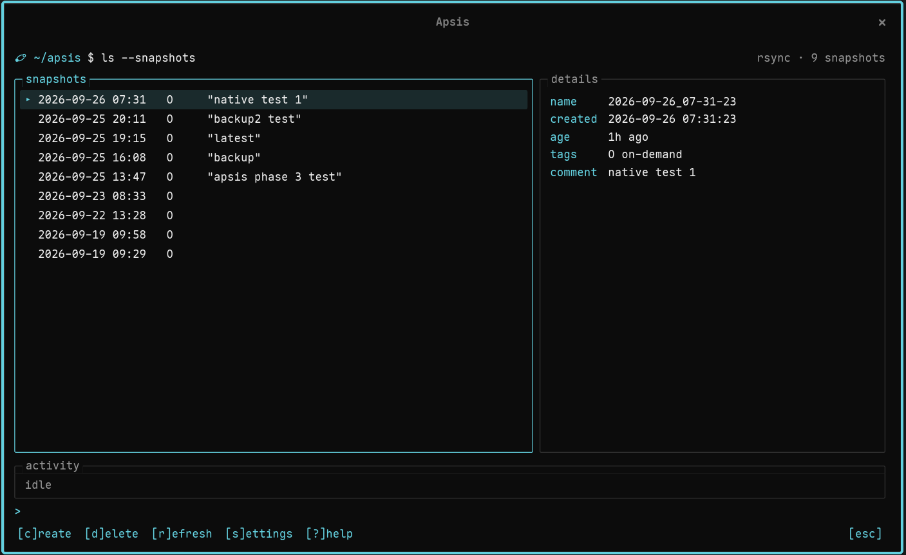

<p align="center">
  
</p>

<h1 align="center">Apsis</h1>

<p align="center">Timeshift-style system snapshots for the COSMIC™ desktop.</p>

A panel applet with a small terminal-style popup to list, create and delete system snapshots.
It works with keyboard or mouse and follows your COSMIC theme.

> **Status:** 0.1.1. Listing, creating and deleting snapshots through Timeshift is the stable
> core. The native rsync backend and restoring files are **experimental**; see below.

<p align="center"></p>
<p align="center"></p>

## Features

- **Snapshot list** in the panel popup: date, tags (O/B/H/D/W/M) and comment, with a details
  pane, and the age of the last snapshot in the panel button's tooltip.
- **Create and delete** snapshots through Timeshift, with a comment, and `[y/N]` before a delete.
- **Settings**: backup device, rsync or btrfs mode, schedules and how many to keep, home
  folders per user, and filters, written to Timeshift's own settings file.
- **Keyboard first**: vim-style keys (`j`/`k`, `c`reate, `d`elete, `s`ettings, `?` help) and a
  `>` input line, or just use the mouse.
- **Follows the COSMIC theme** live: colours, corner radius, font. No hard-coded colours.
- **Window mode**: the app launcher's **Apsis** entry opens the same view in a resizable window
  (`apsis --window`).
- **One password prompt** per few minutes, not per action, through a small polkit-guarded
  helper.
- **Experimental: native rsync backend.** Creates Timeshift-compatible rsync snapshots without
  running `timeshift` (Timeshift still lists and deletes them), with a dry run that shows the
  whole plan first. Off by default; switch it on in *settings → apsis → backend*.
- **Experimental: file-level restore.** Browse a snapshot's files, see what differs from the
  running system, mark files or folders, and restore them to `~/Apsis-restored/<snapshot>/`
  (default) or back to their original place, after a dry run. Original mode keeps the replaced
  file as `<name>.apsis-before-<snapshot>` and asks for the password every time.

### Experimental features

The native backend and restore have been tested on the author's machine (Pop!_OS, Timeshift
24.01.1, rsync mode, an ext4 backup disk) and have unit and integration tests, but they haven't
had wide use yet. Before relying on them:

- keep Timeshift itself working as your main way back;
- read the dry run before running anything for real;
- prefer restoring to `~/Apsis-restored/` and copying files over by hand;
- btrfs mode and encrypted backup devices aren't supported by either yet.

Full-system restore isn't in Apsis; use Timeshift for that.

## Requirements

- COSMIC desktop (Pop!_OS 24.04 or any distribution shipping COSMIC)
- [Timeshift](https://github.com/linuxmint/timeshift), set up at least once (backup device
  chosen). Apsis drives its command-line interface.
- `rsync` (for the native backend and restore; Timeshift depends on it anyway)
- A polkit agent (COSMIC has one)

To build:

- Rust (stable) and [`just`](https://github.com/casey/just)
- libcosmic's build dependencies. On Pop!_OS / Ubuntu / Debian:

  ```sh
  sudo apt install cargo just pkgconf libexpat1-dev libfontconfig-dev libfreetype-dev \
    libxkbcommon-dev libwayland-dev
  ```

## How to use

New to COSMIC or Timeshift? **Timeshift** takes *snapshots*: copies of your system files
(programs, settings in `/etc`, and optionally your home folder) on a backup disk, so you can go
back if an update or a change breaks something. **Apsis** is a small window into Timeshift that
lives in the COSMIC panel (the bar at the top or bottom of the screen).

### Install

**From the .deb (Pop!_OS / Ubuntu 24.04 or newer, amd64)**

The .deb is built on Ubuntu 24.04 and needs its system libraries (glibc 2.39 or newer), so it
won't install on older releases; build from source there.

1. Download `apsis_<version>_amd64.deb` from the
   [releases page](https://github.com/atraxsrc/apsis/releases).
2. Install it from the folder you downloaded it to:

   ```sh
   sudo apt install ./apsis_*.deb
   ```

   This also pulls in `rsync`, and `timeshift` unless you skip recommended packages.

**From source**

```sh
git clone https://github.com/atraxsrc/apsis
cd apsis
just                 # build (release); needs the build requirements above
sudo just install    # the applet, its launcher entry, and apsis-helper
```

> Switching from a source install to the .deb? Run `sudo just uninstall` in the source folder
> first, so no stray copy is left behind.

Both install the same files, including `apsis-helper`: a small root service that runs Timeshift
for Apsis, with polkit deciding who may do what. What runs as root: [SECURITY.md](SECURITY.md).
Files and design: [docs/ARCHITECTURE.md](docs/ARCHITECTURE.md).

### First run

1. **Pick a backup disk.** Timeshift needs to know where snapshots go. Open Apsis's settings
   (`s`) and choose a `device`, then `w` to save; or set it up once in Timeshift's own window.
   An external disk or a second partition is best; a snapshot on the same disk won't help if
   that disk dies.
2. **Add the applet to the panel:** *COSMIC Settings → Desktop → Panel → Configure panel
   applets*, then add **Apsis**. Its icon (an orbit) appears in the panel; click it.
3. **Or use it as a window:** open **Apsis** from the app launcher. Same view, same keys.

### Everyday use

| to... | do this |
|---|---|
| see your snapshots | click the panel icon. The newest is at the top; the right pane shows details |
| create a snapshot | press `c`, type a comment (e.g. `before driver update`), press Enter |
| delete a snapshot | select it, press `d`, type `y`, press Enter (anything else cancels) |
| refresh | `r` |

A spinner in the **activity** pane shows what's running; the result stays there afterwards.
The first rsync snapshot copies the whole system and can take a while; later ones only copy
what changed.

**Why does it ask for my password?** Snapshots touch system files, so creating, deleting,
browsing, restoring and changing settings run as root, and your system asks you (polkit) to
confirm with your password. It's remembered for a few minutes, so a second action right after
doesn't ask again. Listing needs no password. The one exception is putting files back in their
original place: that asks every time, on purpose.

### Keys

Every `[key]` hint at the bottom of the popup is also a button, every row can be clicked, and
`?` shows this list inside Apsis.

| where | key | does | mouse |
|---|---|---|---|
| list | `↑` `↓` / `j` `k`, `Home` `End` | move | click a row |
| list | `c` / `d` / `r` | create / delete / refresh | `[c]reate` / `[d]elete` / `[r]efresh` |
| list | `Enter` | browse the snapshot's files | double-click |
| list | `Tab` | details pane, and back | |
| list | `s` / `?` | settings / help | `[s]ettings` / `[?]help`, or right-click the panel icon |
| browser | `Enter` or `l` / `⌫` or `h` | into a folder / up one | double-click a folder |
| browser | `space` / `J` | mark or unmark / mark and move down | double-click a file |
| browser | `R` / `r` | restore marked / read folder again | `[R]estore` / `[r]eload` |
| settings | `space` | change the selected row | `[space]change` |
| settings | `+` `-` `e` | keep one more / one fewer / type it | `[+]` `[-]` |
| settings | `a` / `x` | add filter / remove selected filter | `[a]dd` / `[x]remove` |
| settings | `w` / `r` | write to Timeshift / reload, dropping changes | `[w]rite` / `[r]eload` |
| anywhere | `Esc` | cancel, go back, then close | `[esc]` |

### Restoring a file (experimental)

Say you broke `~/.bashrc` or a file in `/etc` and want yesterday's copy:

1. Select a snapshot from before the change and press **Enter**. Apsis asks for your password
   and shows the snapshot's files, starting at `/`.
2. Move to the file with the arrow keys, **Enter** to go into folders, **h** to go up.
   The mark in front says how it compares to your system now: `+` missing now, `~` changed,
   `=` same.
3. Press **space** to mark it (mark as many as you like, across folders).
4. Press **R**. The `>` line asks *folder or original*; press **f**, then **Enter**.
5. Apsis does a dry run and shows the plan: what it would copy and where. Nothing is written
   yet. Read it, then press **Enter** to run it (or **Esc** to back out).

**Where do the files go?** Into `~/Apsis-restored/<snapshot>/<original path>`, owned by you,
e.g. `~/Apsis-restored/2026-09-25_03-00-01/home/you/.bashrc`. Your live files aren't touched;
compare and copy what you need by hand. A second restore from the same snapshot goes to
`<snapshot>-2/`, and so on.

**Original mode** (`o` instead of `f`) writes the files back over the running system. Use it
only when you're sure, e.g. for a config file you know is broken:

- it asks `put N item(s) back over the running system? [y/N]`, only `y` continues, and the
  password is asked every time;
- each file it replaces is kept next to it as `<name>.apsis-before-<snapshot>`
  (e.g. `/etc/fstab.apsis-before-2026-09-25_03-00-01`), so you can undo it by renaming that
  back;
- the dry run warns about `/etc` and `/usr`; replacing system files while they're in use can
  break things. For a whole broken system, use Timeshift's full restore instead.

### Settings

`s` (or right-click the panel icon → *Settings…*) opens Timeshift's own settings. Changes are
marked `(unsaved)` until you press `w`.

| setting | what it does |
|---|---|
| `device` | the backup disk; `space` picks the next one that can hold snapshots |
| `mode` | `rsync` copies files to the backup disk (the usual choice); `btrfs` snapshots the system disk itself (only offered on btrfs systems) |
| `@home` | btrfs mode only: include the home subvolume |
| `schedule` | monthly, weekly, daily, hourly and at boot: on or off, and how many of each to keep |
| `home` | rsync mode, per user: home folder excluded, hidden files only (settings), or everything |
| `filters` | extra paths to include (`+`) or exclude; `a` adds, `x` removes |
| `apsis` → `backend` | **experimental**: `native rsync` makes snapshots without running Timeshift. Off by default |
| `apsis` → `dry run` | with the native backend: show the plan instead of creating (on by default) |

> **Close Timeshift's own window first.** If it's open while you save here, it writes its own
> settings over yours when it closes. Apsis warns you in the activity pane when it's open.

### Troubleshooting

| you see | what to do |
|---|---|
| `backup disk not connected (...)` | plug the backup disk in (and unlock it if needed), then press `r` |
| the applet isn't in the panel list, or doesn't show after installing | log out and back in, or remove it in *Configure panel applets* and add it again |
| `list: E: Failed to remove directory` in the activity pane | a harmless Timeshift warning, usually a leftover mount from an earlier run (often after the disk was unplugged). The list itself is still correct; a reboot clears the stale mount |
| `... needs apsis-helper (sudo just install)` | the helper isn't installed: reinstall the .deb or run `sudo just install` |
| anything else | read the helper's log: `journalctl -u apsis-helper -e` (add `-f` to follow it live) |

### Uninstall

```sh
sudo apt remove apsis      # installed from the .deb
sudo just uninstall        # installed from source, run in the source folder
```

Your snapshots stay on the backup disk; Timeshift still lists and restores them.

## Development

```sh
just run             # run in a window, no root needed
cargo test --workspace
just check           # clippy
just deb             # build the .deb into target/debian/ (needs cargo-deb)
```

## Name

Apsis is not an acronym.

In orbital mechanics an **apsis** (plural *apsides*, pronounced *AP-sis* / *AP-sih-deez*) is a
turning point on a body's path: **periapsis** at the nearest point, **apoapsis** at the farthest.
A system snapshot is the same idea: a fixed point on the machine's timeline that you can return to.

The logo shows exactly that: an orbit with its two apsides, the glowing one being the point you
come back to.

## Security

Please report vulnerabilities privately; see [SECURITY.md](SECURITY.md).

## License

GPL-3.0-only. See [LICENSE](LICENSE).
