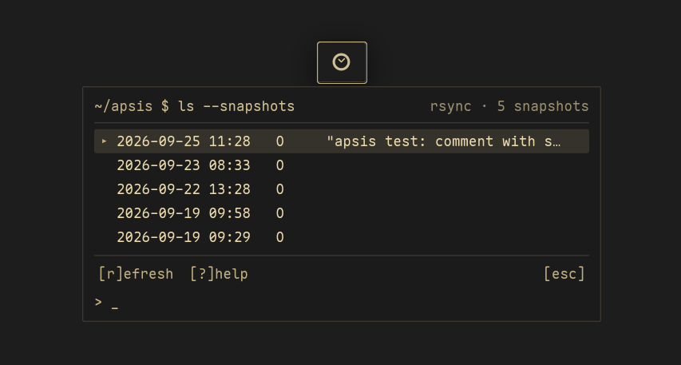

<p align="center">
  
</p>

<h1 align="center">Apsis</h1>

<p align="center">Timeshift-style system snapshots for the COSMIC™ desktop.</p>

A panel applet with a small terminal-style popup to list, create and delete system snapshots.
It works with keyboard or mouse and follows your COSMIC theme.

> **Status:** 0.1.0, the first release. Listing, creating and deleting snapshots through
> Timeshift is the stable core. The native rsync backend and restoring files are
> **experimental**; see below.

<p align="center"></p>

## Features

- **Snapshot list** in the panel popup: date, tags (O/B/H/D/W/M) and comment, with a details
  pane, and the age of the last snapshot in the panel button's tooltip.
- **Create and delete** snapshots through Timeshift, with a comment, and `[y/N]` before a delete.
- **Settings**: backup device, rsync or btrfs mode, schedules and how many to keep, home
  folders per user, and filters, written to Timeshift's own settings file.
- **Keyboard first**: vim-style keys (`j`/`k`, `c`reate, `d`elete, `s`ettings, `?` help) and a
  `>` input line, or just use the mouse.
- **Follows the COSMIC theme** live: colours, corner radius, font. No hard-coded colours.
- **Window mode**: the app launcher's **Apsis** entry opens the same view in a resizable window
  (`apsis --window`).
- **One password prompt** per few minutes, not per action, through a small polkit-guarded
  helper.
- **Experimental: native rsync backend.** Creates Timeshift-compatible rsync snapshots without
  running `timeshift` (Timeshift still lists and deletes them), with a dry run that shows the
  whole plan first. Off by default; switch it on in *settings → apsis → backend*.
- **Experimental: file-level restore.** Browse a snapshot's files, see what differs from the
  running system, mark files or folders, and restore them to `~/Apsis-restored/<snapshot>/`
  (default) or back to their original place, after a dry run. Original mode keeps the replaced
  file as `<name>.apsis-before-<snapshot>` and asks for the password every time.

### Experimental features

The native backend and restore have been tested on the author's machine (Pop!_OS, Timeshift
24.01.1, rsync mode, an ext4 backup disk) and have unit and integration tests, but they haven't
had wide use yet. Before relying on them:

- keep Timeshift itself working as your main way back;
- read the dry run before running anything for real;
- prefer restoring to `~/Apsis-restored/` and copying files over by hand;
- btrfs mode and encrypted backup devices aren't supported by either yet.

Full-system restore isn't in Apsis; use Timeshift for that.

## Requirements

- COSMIC desktop (Pop!_OS 24.04 or any distribution shipping COSMIC)
- [Timeshift](https://github.com/linuxmint/timeshift), set up at least once (backup device
  chosen). Apsis drives its command-line interface.
- `rsync` (for the native backend and restore; Timeshift depends on it anyway)
- A polkit agent (COSMIC has one)

To build:

- Rust (stable) and [`just`](https://github.com/casey/just)
- libcosmic's build dependencies. On Pop!_OS / Ubuntu / Debian:

  ```sh
  sudo apt install cargo just pkgconf libexpat1-dev libfontconfig-dev libfreetype-dev \
    libxkbcommon-dev libwayland-dev
  ```

## Install

```sh
git clone https://github.com/atraxsrc/apsis
cd apsis
just                 # build (release)
sudo just install    # the applet, its launcher entry, and apsis-helper
```

Then add the applet to a panel in *Settings → Desktop → Panel → Applets*.

`just install` also installs `apsis-helper`: a small root D-Bus service that runs Timeshift for
the applet, with polkit deciding who may do what. Listing needs no password; creating or
deleting asks once ("Apsis needs your password…") and polkit remembers it for a few minutes.
Without the helper the applet falls back to `pkexec`, which asks every time; the native backend
and restore need the helper. What runs as root and which polkit actions exist:
[SECURITY.md](SECURITY.md). Files and design: [docs/ARCHITECTURE.md](docs/ARCHITECTURE.md).

To remove it:

```sh
sudo just uninstall
```

### Development

```sh
just run             # run in a window, no root needed
cargo test --workspace
just check           # clippy
```

## Name

Apsis is not an acronym.

In orbital mechanics an **apsis** (plural *apsides*, pronounced *AP-sis* / *AP-sih-deez*) is a
turning point on a body's path: **periapsis** at the nearest point, **apoapsis** at the farthest.
A system snapshot is the same idea: a fixed point on the machine's timeline that you can return to.

The logo shows exactly that: an orbit with its two apsides, the glowing one being the point you
come back to.

## Security

Please report vulnerabilities privately; see [SECURITY.md](SECURITY.md).

## License

GPL-3.0-only. See [LICENSE](LICENSE).
