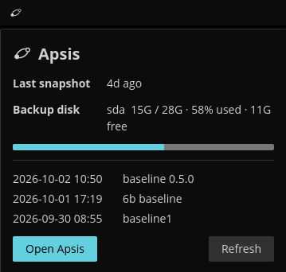
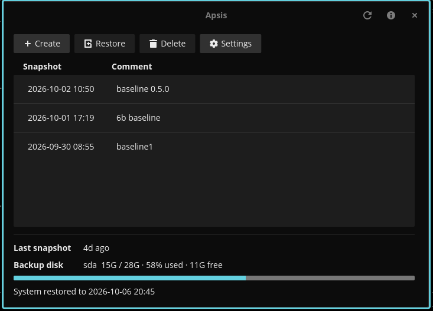
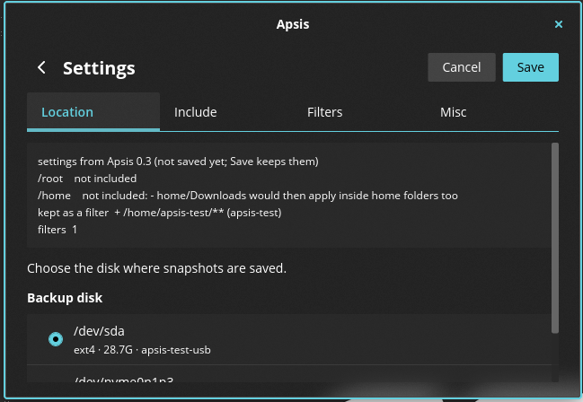
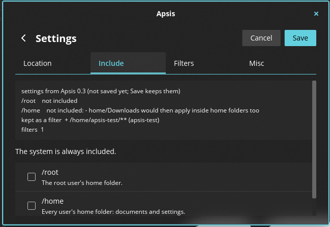

<p align="center">
  
</p>

<h1 align="center">Apsis</h1>

<p align="center">System snapshot and restore for the COSMIC™ desktop.</p>
<p align="center">
  
</p>
<p align="center">
  
</p>
<p align="center">
  
</p>
<p align="center">
  
</p>

Apsis takes snapshots of your system, the way Timeshift does, and lives in the COSMIC panel.
The panel shows when the last snapshot was taken and how full the backup disk is; the window
creates, lists and deletes snapshots and holds the settings.

Timeshift works fine on COSMIC. Apsis is a native alternative, and Timeshift can still read its
snapshots.

> **Status:** 0.5.0. Apsis takes rsync snapshots itself and doesn't need
> Timeshift. It uses Timeshift's layout on the backup disk, so snapshots Timeshift made keep
> working in Apsis. Manual only: there is no schedule, and a snapshot
> is only deleted when you delete it. **Restoring the whole system is new in 0.5.0 and
> experimental**: it works on Pop!_OS with systemd-boot, and the restore runs at the next
> start, outside the desktop. Read "If a restore goes wrong" below before you rely on it.

## What it does

- **Snapshots with rsync.** The first one copies the system to your backup disk; later ones
  copy only what changed and hard-link the rest, so each looks complete but costs only the
  changes. rsync runs at idle priority, so the desktop stays responsive.
- **Two choices of what to include** besides the system: `/root` and `/home`.
- **A filter list**, like Timeshift's Filters tab: folders, files or patterns to leave out
  (`-`) or keep (`+`).
- **Delete snapshots**, one or several at once.
- **Restore the whole system** to a snapshot (0.5.0, experimental). Apsis checks the snapshot
  fits this computer, takes a safety snapshot of the system as it is now, and puts the system
  files back at the next start, outside the desktop, then starts normally. Your home folders
  are kept unless you choose to restore them too.
- **Stop** a snapshot while it's being made; what it copied so far is removed.
- **Status in the panel**: the tooltip shows the last snapshot and the backup disk; an optional
  label beside the icon shows both at a glance. The icon turns the warning colour when the last
  snapshot is older than a week (you choose how long), or the disk is nearly full.
- **Follows the COSMIC theme** live: light and dark, accent colour, fonts.

Not in Apsis: scheduled snapshots, automatic deletion, restoring single files, btrfs
snapshots, and encrypted backup disks.

**How restore differs from Timeshift's.** Timeshift restores from the running system or a live
USB and rebuilds the boot files for the bootloader it finds. Apsis restores at the next start
(systemd's offline-update mode, like a Pop!_OS release upgrade), so no file is in use while it's
replaced; it keeps the live `fstab` and `crypttab` and the boot partition's layout, refreshes
the boot files with kernelstub exactly as Pop!_OS's own kernel hooks do, uses the snapshot's
initrds as they are, keeps the kernel the computer started with until the new boot files have
been checked, and keeps the old boot files if the refresh or the check fails. It never restores
onto another installation, and it refuses rather than guesses.

## Requirements

- COSMIC desktop (Pop!_OS 24.04 or any distribution shipping COSMIC)
- `rsync`, and a polkit agent (COSMIC has one)
- A backup disk with a plain, **unencrypted** Linux filesystem (ext4, btrfs, xfs...).
  **Encrypted (LUKS) backup disks aren't supported yet.**
- Timeshift isn't needed. If it was set up before, Apsis takes its backup disk and filters
  once (you confirm with Save), keeps using its snapshots, and never runs it.

To build:

- Rust (stable) and [`just`](https://github.com/casey/just)
- libcosmic's build dependencies. On Pop!_OS / Ubuntu / Debian:

  ```sh
  sudo apt install cargo just pkgconf libexpat1-dev libfontconfig-dev libfreetype-dev \
    libxkbcommon-dev libwayland-dev
  ```

## Install

**From the .deb (Pop!_OS / Ubuntu 24.04 or newer, amd64)**

1. Download `apsis_<version>_amd64.deb` from the
   [releases page](https://github.com/atraxsrc/apsis/releases).
2. Install it from the folder you downloaded it to:

   ```sh
   sudo apt install ./apsis_*.deb
   ```

**From source**

```sh
git clone https://github.com/atraxsrc/apsis
cd apsis
just                 # build (release); needs the build requirements above
sudo just install    # the applet, its launcher entry, and apsis-helper
```

Both install `apsis-helper`: a small root service that does the work that needs root
(mounting the backup disk, rsync, deleting a snapshot, writing the settings), with polkit
deciding who may do what. What runs as root: [SECURITY.md](SECURITY.md). Files and design:
[docs/ARCHITECTURE.md](docs/ARCHITECTURE.md).

**Upgrading from 0.3?** Open the settings once. Your old settings are shown as they will be
saved (a note at the top says what changed: a home folder set to "everything" becomes the
`/home` choice, "hidden files only" becomes a `+` filter); snapshots keep holding the same
files. Click Save. File restore is gone in 0.4: anything already in `~/Apsis-restored/`, and
any `*.apsis-before-*` file next to an original, is yours and can be deleted by hand.

**Upgrading, reinstalling or removing while Apsis is busy.** From 0.5.0 the package waits
its turn. While a snapshot, a delete, a restore's preparation or a settings save runs, apt
stops with `apsis: an Apsis job is running; try again when it has finished`: the package
stays as it was and the job goes on. Run the same command again once the job has finished.
At the "Ready to restore" prompt the package operation goes on, and the window then says the
preparation is gone. After "Restart now", while the restore waits for its restart, the
package operation cancels the restore and says `apsis: the restore that was waiting for a
restart is cancelled`; the safety snapshot stays, and the restore can be started again
afterwards.

**The upgrade from 0.4.x doesn't wait.** It runs the installed 0.4.x package's script, which
stops the helper even in the middle of a snapshot or a delete. Upgrade from 0.4.x while
nothing runs.

## Use

1. **Add the applet to the panel:** *COSMIC Settings → Desktop → Panel → Configure panel
   applets*, then add **Apsis**. Click its icon for the overview, then **Open Apsis**. Or open
   **Apsis** from the app launcher.
2. **Choose a backup disk:** **Settings → Location**, pick the disk, **Save** (your password is
   asked). An external disk is best; a snapshot on the same disk won't help if that disk dies.
3. **Take a snapshot:** **Create**, type a comment if you like, **Create**. The first one copies
   the whole system and can take a while. The bottom of the window shows how far it is and the
   time left, and **Stop** if you change your mind.

To delete: select one or more snapshots (Ctrl-click or Shift-click for several), **Delete**,
confirm. Several are deleted in one go, in list order, and your password is asked once; if one
fails, the rest are left alone and the status line says which were deleted. A dimmed "Unfinished
snapshot or delete" row is what's left of a snapshot or a delete that was cut off (power loss, a
crash): select it and **Delete**. The next snapshot removes most of them by itself, but never
one still in `timeshift/snapshots/` (a delete cut off by an older Apsis leaves it there).
**Known limit:** a folder in `timeshift/snapshots/` with no `info.json` is only a warning, and
Apsis won't delete it; it needs removing by hand, as root.

4. **Restore the system** (0.5.0, experimental): select one snapshot, **Restore**. Apsis checks
   that the snapshot fits this computer (same installation, UEFI, Pop!_OS with systemd-boot,
   a plain ext4 system disk) and shows the choices: keep your home folders as they are now
   (default) or restore them too, and take a safety snapshot first (on by default). The safety
   snapshot is the way back: the system as it was right before the restore, listed as "Safety
   snapshot, before restoring <date>", costing only the files that differ from the newest
   snapshot. To undo the restore, restore it like any other snapshot; without it there is no
   way back. **Restore**
   then prepares: it measures the space, takes the safety snapshot and writes the plan. **Ready to restore** is the last word: **Restart now** restarts the
   computer, restores the system with the desktop stopped, and restarts once more; **Cancel
   restore** (or Esc, or closing the window) drops the plan and keeps the safety snapshot.
   Once it restarts, the restore can't be stopped: don't turn off the computer until it's
   back at the login screen. After you log in, the window's status line says how it went.

**Why does it ask for my password?** Snapshots touch system files, so creating, deleting and
saving the settings run as root, and your system asks you (polkit) to confirm. It's remembered
for a few minutes. Listing needs no password, and neither does stopping a snapshot you started.
A restore asks every time.

### Known limitations of restore

- **Experimental**, and for **Pop!_OS 24.04 with systemd-boot (kernelstub) only**. Other
  distributions, GRUB, BIOS boot, btrfs, and a system split over `/boot`, `/usr` or `/var`
  partitions are refused before anything happens.
- **An encrypted system disk works in one layout**: the one Pop!_OS's installer makes with
  "Encrypt drive" (an LVM volume inside one LUKS partition), on the installation the
  snapshot was made of. Any other encrypted or LVM layout is refused. The disk's passphrase
  is asked twice: at the restart that runs the restore, and at the start after it.
- **A snapshot from another installation is refused**: it must have been taken of this
  system disk.
- **A file changed in place with the same size and modification time** as in the snapshot
  isn't restored. rsync compares size and time; checking every file's content on both sides
  would take far too long for a whole system.
- **Hard links aren't kept** in snapshots (as in Timeshift). Flatpak's data is hard-link
  heavy, so it takes more room in a snapshot and can take more on the system disk after a
  restore. After a restore that keeps your home folders, a user Flatpak app may say its
  runtime isn't installed: `flatpak install` or `flatpak repair` fixes it.
- **The live `/etc/fstab` and `/etc/crypttab` are kept**, not the snapshot's: they describe
  the disks as they are now. A snapshot whose `crypttab` differs from the current one is
  refused.
- **The boot files are refreshed with kernelstub only**, as Pop!_OS's own kernel hooks do,
  told which kernel the snapshot boots; the snapshot's initrds are used as they are, not
  rebuilt. If the refresh fails, or the new boot files fail the check, the computer keeps
  the boot files and the kernel it started with
  ("still boots the previous kernel"); the next kernel update should set that right.
- `/root` is restored with the system if the snapshot has it (with content); otherwise it's
  left as it is.
- Home folders restored "too" go back to the snapshot entirely: files created or changed
  since are deleted or put back to their old version. The safety snapshot includes your home
  folders in that case, so they're on the backup disk.
- **A snapshot whose delete was cut off by Apsis 0.4.x or Timeshift can look whole** when
  the cut came before its `info.json` and `exclude.list` went. Restoring it would remove
  from the system what it lacks; the safety snapshot is the way back. Delete such a
  snapshot instead of restoring it.

### If a restore goes wrong

A restore never touches the recovery partition or the **Pop_OS-oldkern** entry; the steps
below do: they rebuild that entry's initrd and rewrite its files on the ESP. They make no
backup of the ESP first (the restore itself does).

While preparing, Apsis writes `timeshift/apsis-restore-RECOVER.txt` on the backup disk: these
steps with this machine's disk UUIDs and the snapshots' names filled in (and, on an
encrypted system disk, the lines that unlock it), two complete
commands and no line to edit, each line short enough for an 80-column console. It's written
again at every preparation. When the restore is armed ("Restart now"), its copy is kept as
`/var/lib/apsis/restore/last-restore.note` on the system disk (root only), readable once step
2's first mount line has run. If the two differ, follow `last-restore.note`. `RECOVER.txt` is
on the disk that step 2 mounts, so the UUIDs for the mount lines come from `lsblk -f`.

**Known limit:** these steps are untried after a restore that changed the kernel (the
restore's filter keeps out the kernel that ran when it was prepared). When the system still
starts from either boot entry, the way back is the window: restore the safety snapshot there.

1. At power-on, hold Space for the systemd-boot menu and pick **Pop!_OS Recovery**, or boot
   a Pop!_OS live USB of the same version. The recovery opens an installer window: don't
   click its install choices (they reinstall the system).
2. In a terminal, one line at a time. If a line prints error, failed or E:, stop there: the
   lines after it count on it. `update-initramfs` and `kernelstub` print a lot; that alone
   is fine. `lsblk -f` shows the UUIDs, and Tab completes the paths.

   If the live system mounted the backup disk by itself, unmount it first:
   `sudo umount /dev/disk/by-uuid/<backup-uuid>`.

   On an encrypted system disk (Pop!_OS's "Encrypt drive"), unlock it first and bring up its
   LVM volume. Use the name the installed system's `/etc/crypttab` has for it (`cryptdata`
   on a default install; `RECOVER.txt` has the line with the name and the UUID filled in):
   `update-initramfs` below looks that name up, and with another name it builds an initrd
   that can't unlock the disk. `cryptsetup` asks for the disk's passphrase.

   ```sh
   sudo cryptsetup luksOpen /dev/disk/by-uuid/<luks-partition-uuid> cryptdata
   sudo vgchange -ay
   ```

   If `luksOpen` says the device is in use, the live system opened it under another name,
   which `lsblk` shows below the partition: `sudo vgchange -an`, then `sudo cryptsetup close
   <that name>`, then the two lines again. **Known limit:** the two unlock lines have run
   in a recovery once (2026-10-06, Pop!_OS's standard encrypted install, the same
   installation); the "in use" case has not.

   Mount the system disk, its boot partition (ESP) and the backup disk, read-only:

   ```sh
   sudo mount /dev/disk/by-uuid/<root-uuid> /mnt
   sudo mount /dev/disk/by-uuid/<esp-uuid> /mnt/boot/efi
   sudo mkdir -p /media/backup
   sudo mount -o ro /dev/disk/by-uuid/<backup-uuid> /media/backup
   ```

   The note on the system disk is root's; once the first mount line has run, read it with:

   ```sh
   sudo cat /mnt/var/lib/apsis/restore/last-restore.note
   ```

   Then one of these. Copy the line from `RECOVER.txt` (or the note): it has the right
   flags for the snapshot, and the names filled in.

   (a) Restore the same snapshot again:

   ```sh
   sudo rsync -a -A -X --numeric-ids --delete --force --sparse \
     --exclude-from=/mnt/var/lib/apsis/restore/last-restore.filter \
     /media/backup/timeshift/snapshots/<snapshot>/localhost/ /mnt/
   ```

   (b) Go back to the safety snapshot:

   ```sh
   sudo rsync -a -A -X --numeric-ids --delete --force --sparse \
     --exclude-from=/mnt/var/lib/apsis/restore/last-restore.filter \
     /media/backup/timeshift/snapshots/<safety-snapshot>/localhost/ /mnt/
   ```

   `-A -X` only for a snapshot made by Apsis 0.4.1 or later; a safety snapshot always is.
   Without a safety snapshot, `RECOVER.txt` says so in place of (b).

   If rsync can't open the filter, stop: never run these lines without it. Without
   `last-restore.filter` rsync exits 11 before it copies or deletes anything. After `apt
   purge apsis` the state folder is gone: the note's rsync lines stop with exit 11 and change
   nothing.

   Then the boot files:

   ```sh
   for d in dev proc sys run; do sudo mount --rbind /$d /mnt/$d; done
   sudo chroot /mnt update-initramfs -u -k all
   sudo chroot /mnt kernelstub --verbose
   sudo rm -f /mnt/system-update
   ```

   `update-initramfs` rebuilds both initrds and takes about two minutes. The last line
   matters: while `/system-update` exists, the next start would try the restore again.

   Then check that the result boots: the ESP's kernel and initrd must be the ones `/boot`
   links to. Each line prints nothing when they are the same, and `differ` when not:

   ```sh
   sudo cmp /mnt/boot/efi/EFI/Pop_OS-<root-uuid>/vmlinuz.efi /mnt/boot/$(basename $(readlink /mnt/boot/vmlinuz))
   sudo cmp /mnt/boot/efi/EFI/Pop_OS-<root-uuid>/initrd.img /mnt/boot/$(basename $(readlink /mnt/boot/initrd.img))
   ```

   If either prints anything, don't restart: the computer may not start.

   The filter's rules are anchored at the transfer root, so they work unchanged against
   `/mnt/`. `--rbind /sys` brings `efivars` for kernelstub. `--numeric-ids` matters here: the
   live system's user database isn't the installed one.
3. Restart, from the panel. Nothing needs to be unmounted first.

After a restore by hand the window still names the restore before it: its line comes from
`result.json`, which these steps keep as it is.

If the status line after a restore says **incomplete**, the copy broke (most often the backup
disk was disconnected): reconnect it and click **Restore again**, or restore the safety
snapshot. **The restore didn't start** means nothing was changed. If a restore stops with an
error after the safety snapshot was taken, the snapshot stays in the list; delete it if you
don't want it. **Some files were not restored**: rsync's log names them, and it's root's:
`sudo less /var/lib/apsis/restore/rsync-log`. See the helper's log for the details:
`journalctl -b -1 -u apsis-restore` (the restore's own boot) and `journalctl -u apsis-helper`.

### Keyboard shortcuts

| key | does |
|---|---|
| `Ctrl+N` | Create |
| `Delete` | Delete the selected snapshots |
| `Ctrl+R`, `F5` | Refresh |
| `Ctrl+,` | Settings |
| `Ctrl+A` | Select all |
| `↑` `↓` | Move the selection |
| `Esc` | Close a dialog (on the "Ready to restore" prompt: cancel the restore), leave the settings, clear the selection |

Restore has no shortcut: click it, or Tab to it and press Enter.

## Settings

**Location**: the disk snapshots go to. Only disks that can hold snapshots can be picked (a
Linux filesystem, not encrypted); the others are listed with the reason.

**Include**: the system is always included. `/root` is the root user's home folder (on by
default). `/home` is every user's home folder: documents, photos and settings (off by
default). With `/home` included, a full restore (0.5.0) puts your documents back as they were
in the snapshot too.

**Filters**: each line is `+` (keep) or `-` (leave out) and a pattern. rsync takes the
**first** line that matches, top to bottom, so order matters: new lines go on top, and Move Up
/ Move Down reorder them. Add Folder and Add File pick a path; Add Pattern takes a typed one
(start it with `+ ` to include; anything else is excluded). Built-in excludes (`/proc`, `/dev`,
`/tmp`, caches, other mounts) always come first.

- `*` matches any name within one folder level; it doesn't cross a `/`.
- `**` matches anything, across folders.
- `***` after a folder means the folder and everything in it.
- A pattern starting with `/` starts at the root of the system. Without the leading `/`, a
  pattern with a `/` in it matches the end of any path: `- home/Downloads` leaves out
  `/home/Downloads` and `/srv/home/Downloads`, not `/home/you/Downloads`.

| filter | effect |
|---|---|
| `- /var/lib/libvirt/***` | leave out virtual machine disk images |
| `- /home/*/Downloads/***` | leave out every user's Downloads folder (with `/home` included) |
| `+ /home/you/Projects/***` | keep one folder of your home even with `/home` left out |

**Misc** (saved at once, for you only): **Remind me** after this many days without a snapshot
(0 turns it off), and the **Panel label**.

## Troubleshooting

| you see | what to do |
|---|---|
| Backup disk not connected | plug it in; Apsis notices and lists again |
| the list fails with a `mount` error that says the disk is already mounted (on `/media/...`) | the desktop opened the backup disk by itself: unmount it in Files (unmount, don't eject), then Refresh |
| can't hold snapshots: it's encrypted or a container | encrypted backup disks aren't supported yet; pick a plain one |
| No backup disk chosen | Settings → Location |
| Apsis needs apsis-helper | reinstall the .deb, or `sudo just install` |
| apt stops with "apsis: an Apsis job is running; try again when it has finished" | a snapshot, a delete, a restore's preparation or a settings save is running: let it finish (or stop it), then run apt again. The package is as it was |
| apt stops with "apsis: a restore is armed and couldn't be disarmed" | a restore waits for its restart and couldn't be cancelled; run the two commands apt printed, then apt again |
| the applet doesn't show after installing | log out and back in, or re-add it in *Configure panel applets* |
| Can't restore this snapshot | the dialog says why and what to do; see "Known limitations of restore" |
| Not deleted: a restart to restore is waiting | "Restart now" was clicked and the restore waits for the restart; restart the computer, or wait ten minutes for it to time out, then delete |
| The preparation is too old / is gone | the "Ready to restore" prompt waited more than 30 minutes, or the helper was restarted; start the restore again |
| Restore incomplete · system partly restored | the copy broke; reconnect the backup disk and **Restore again**, or restore the safety snapshot; see "If a restore goes wrong" |
| Restore finished · some files were not restored | rsync couldn't write or delete some files; the rest of the system is the snapshot's. Which ones: `sudo less /var/lib/apsis/restore/rsync-log` |
| Restore finished · a cleanup step failed | the system is restored; a step after the copy failed (for example, the kernel from before the restore couldn't be removed); the tooltip says what |
| Restore finished · the computer may not start next time | the boot files on the ESP aren't in order: before you restart, read "If a restore goes wrong" and have the recovery or a live USB ready; the tooltip says what went wrong |
| System restored · still boots the previous kernel | the boot files couldn't be refreshed, or failed the check, and the old ones were kept; the next kernel update should set it right |
| the computer keeps restarting into the restore | boot the recovery and `rm /mnt/system-update` as in "If a restore goes wrong" |
| anything else | the helper's log: `journalctl -u apsis-helper -e` |

## Uninstall

```sh
sudo apt remove apsis      # installed from the .deb (apt purge also removes /etc/apsis and /var/lib/apsis)
sudo just uninstall        # installed from source, run in the source folder
```

Your snapshots stay on the backup disk. `apt purge` also removes `/var/lib/apsis`, the
restore's state folder, including the kept recovery pair (`last-restore.filter` and
`last-restore.note`). `apt remove` is refused while a job runs, and cancels a restore that
waits for its restart (see "Upgrading, reinstalling or removing while Apsis is busy").
`just uninstall` runs none of the package's checks: it stops the helper even in the middle
of a job and doesn't cancel a restore that waits for its restart, so run it only while
nothing runs and no restore waits.

## Development

```sh
just run             # run in a window, no root needed
cargo test --workspace
just check           # clippy
just deb             # build the .deb into target/debian/ (needs cargo-deb)
just ext4-image      # an ext4 image for the rsync tests (then mount it, just test-ext4)
APSIS_LAYOUT_TEST=1 cargo test -p apsis fit                     # layouts fit the smallest window (and every restore state)
APSIS_SCREENSHOTS=/tmp/shots cargo test -p apsis screenshots    # renders the views to .rgba files
```

## Name

Apsis is not an acronym.

In orbital mechanics an **apsis** (plural *apsides*, pronounced *AP-sis* / *AP-sih-deez*) is a
turning point on a body's path: **periapsis** at the nearest point, **apoapsis** at the farthest.
A system snapshot is the same idea: a fixed point on the machine's timeline that you can return to.

The logo shows exactly that: an orbit with its two apsides, the glowing one being the point you
come back to.

## Security

Please report vulnerabilities privately; see [SECURITY.md](SECURITY.md).

## License

GPL-3.0-only. See [LICENSE](LICENSE).
