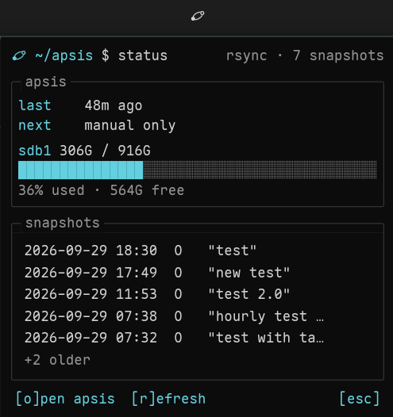
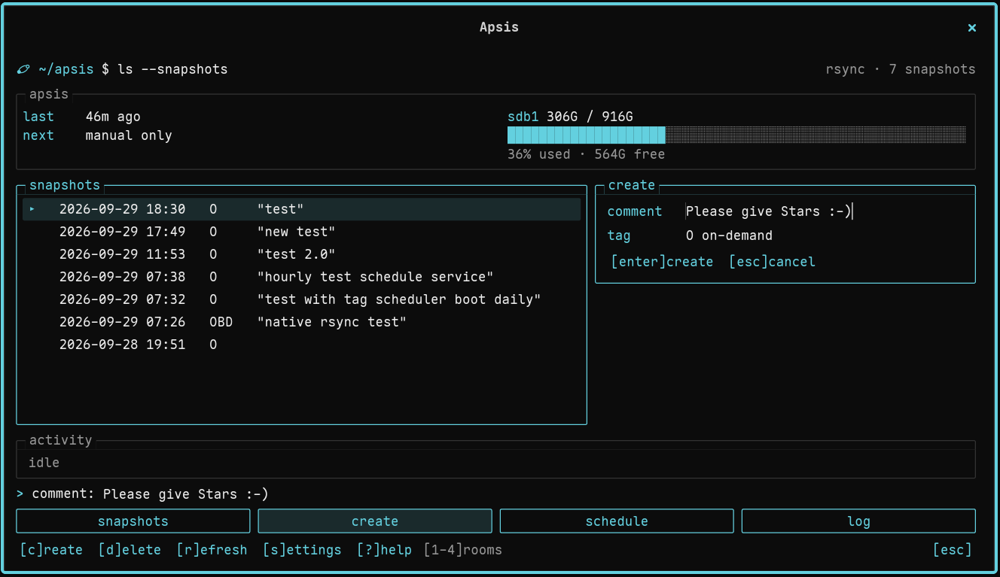
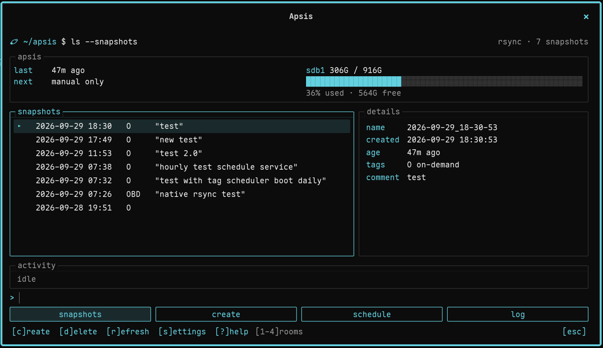
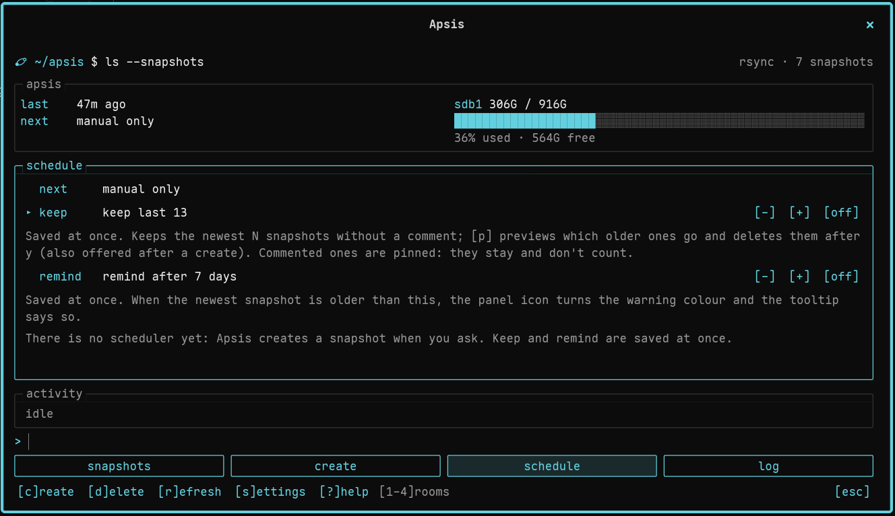

<p align="center">
  
</p>

<h1 align="center">Apsis</h1>

<p align="center">Simple system snapshots and file restore for the COSMIC™ desktop.</p>

A panel applet and a window, both terminal-style, to create, list and delete system snapshots
and to restore single files from them. The panel popup is a read-only overview (last snapshot,
backup disk, the newest snapshots); the window does the work. It works with keyboard or mouse
and follows your COSMIC theme.

> **Status:** 0.3.0. Apsis is standalone: it takes rsync snapshots itself and doesn't need
> Timeshift. It uses Timeshift's on-disk layout, so snapshots Timeshift made keep working in
> Apsis (and the other way round). Manual only: there is no schedule, and a snapshot is only
> deleted when you delete it.

<p align="center"></p>
<p align="center"></p>
<p align="center"></p>
<p align="center"></p>

## Features

- **Snapshots with rsync**: the first one copies the system to your backup disk, later ones only
  copy what changed and hard-link the rest, so each looks complete but costs only the changes.
  rsync runs at idle I/O priority, so the desktop stays responsive.
- **Snapshot list** in the window: date, tags and comment, with a details pane. The panel
  popup shows the newest few, read-only.
- **Status at a glance**: the panel button's tooltip shows `last`, `next` (manual only, for now)
  and `disk`. An optional panel label (a setting) shows the age of the newest snapshot and the
  share of the backup disk in use.
- **Four rooms** in the window: snapshots, create, schedule (keep and remind) and log, with an
  `apsis` strip on top; switch with `1`-`4` or click the dock.
- **Create and delete**, with a comment, and `[y/N]` before a delete. Delete several at once.
  Creates and restores show a progress bar with the time left.
- **Disk usage line** under the list: a bar of the backup disk's used and free space, in the
  theme's warning colour under 10% free and its destructive colour under 5%.
- **Keep the last N snapshots** (optional): `p` shows which older snapshots would go, and
  deletes them only after `y`. Commented ones always stay and don't count.
- **Reminder**: the panel icon turns the theme's warning colour, and the tooltip says so, when
  the last snapshot is older than 7 days (configurable).
- **Restore files**: browse a snapshot's files, see what differs from the running system, mark
  files or folders, and restore them to `~/Apsis-restored/<snapshot>/` (default) or back to their
  original place, after a dry run. Original mode keeps each replaced file as
  `<name>.apsis-before-<snapshot>` and asks for the password every time.
- **Settings**: backup disk, what to keep of each user's home folder, and filters.
- **Works with Timeshift's snapshots**: same folders and files on the backup disk, so existing
  Timeshift snapshots are listed, browsed, restored from and deleted like Apsis's own, and
  Timeshift (if you keep it) still lists Apsis's.
- **Keyboard first**: vim-style keys (`j`/`k`, `c`reate, `d`elete, `s`ettings, `?` help) and a
  `>` input line, or just use the mouse.
- **Follows the COSMIC theme** live: colours, corner radius, font. No hard-coded colours.
- **The window**: the app launcher's **Apsis** entry, or `o` in the panel popup, opens
  it (`apsis --window`; `--settings` and `--about` open it on those views).
- **One password prompt** per few minutes, not per action, through a small polkit-guarded
  helper.

Not in Apsis: scheduled snapshots, automatic deletion, full-system restore, btrfs snapshots,
and encrypted backup disks (see below).

## Requirements

- COSMIC desktop (Pop!_OS 24.04 or any distribution shipping COSMIC)
- `rsync`, and a polkit agent (COSMIC has one)
- A backup disk with a plain, **unencrypted** Linux filesystem (ext4, btrfs, xfs...).
  **Encrypted (LUKS) backup disks aren't supported yet** (Timeshift supports them, by
  unlocking them itself; Apsis doesn't).
- Timeshift isn't needed. If it was set up before, Apsis takes its backup disk and filters
  once (you confirm with `w`), keeps using its snapshots, and never runs it.

To build:

- Rust (stable) and [`just`](https://github.com/casey/just)
- libcosmic's build dependencies. On Pop!_OS / Ubuntu / Debian:

  ```sh
  sudo apt install cargo just pkgconf libexpat1-dev libfontconfig-dev libfreetype-dev \
    libxkbcommon-dev libwayland-dev
  ```

## How to use

A *snapshot* is a copy of your system files (programs, settings in `/etc`, and optionally your
home folder) on a backup disk, so you can get a file back if an update or a change breaks
something. **Apsis** takes them and lives in the COSMIC panel (the bar at the top or bottom of
the screen).

### Install

**From the .deb (Pop!_OS / Ubuntu 24.04 or newer, amd64)**

The .deb is built on Ubuntu 24.04 and needs its system libraries (glibc 2.39 or newer), so it
won't install on older releases; build from source there.

1. Download `apsis_<version>_amd64.deb` from the
   [releases page](https://github.com/atraxsrc/apsis/releases).
2. Install it from the folder you downloaded it to:

   ```sh
   sudo apt install ./apsis_*.deb
   ```

   This also pulls in `rsync`.

**From source**

```sh
git clone https://github.com/atraxsrc/apsis
cd apsis
just                 # build (release); needs the build requirements above
sudo just install    # the applet, its launcher entry, and apsis-helper
```

> Switching from a source install to the .deb? Run `sudo just uninstall` in the source folder
> first, so no stray copy is left behind.

Both install the same files, including `apsis-helper`: a small root service that does the work
that needs root (mounting the backup disk, rsync, deleting a snapshot, writing the config), with
polkit deciding who may do what. What runs as root: [SECURITY.md](SECURITY.md). Files and
design: [docs/ARCHITECTURE.md](docs/ARCHITECTURE.md).

**Upgrading from 0.1 (with Timeshift)?** Open Apsis's settings (`s`) once: they show what was
taken from Timeshift's settings (backup disk, home folders, filters). Press `w` to save them as
Apsis's own. Your snapshots stay where they are.

### First run

1. **Add the applet to the panel:** *COSMIC Settings → Desktop → Panel → Configure panel
   applets*, then add **Apsis**. Its icon (an orbit) appears in the panel; click it for the
   overview, then press `o` to open the window. **Or** open **Apsis** from the app launcher.
   The steps below are in the window.
2. **Pick a backup disk.** Open the settings (`s`), press `space` on `device` until your backup
   disk shows, then `w` to save (your password is asked). An external disk or a second
   partition is best; a snapshot on the same disk won't help if that disk dies.
3. **Take the first snapshot:** press `c`, type a comment, press Enter. The first one copies the
   whole system and can take a while.

### Everyday use

| to... | do this |
|---|---|
| see your snapshots | click the panel icon for the overview, or open the window. The newest is at the top; the right pane shows details |
| create a snapshot | press `c`, type a comment (e.g. `before driver update`), press Enter |
| delete a snapshot | select it, press `d`, type `y`, press Enter (anything else cancels) |
| delete several | mark each with `space` (or `J` to mark and move down), press `d`, type `y`, press Enter. The password is asked once; they're deleted one by one and it stops at the first failure, saying which were deleted |
| clear out old ones | turn on `keep` in the settings, then press `p`: it shows which would go; `y` deletes them |
| refresh | `r` |

A spinner in the **activity** pane shows what's running; the result stays there afterwards.

**Why does it ask for my password?** Snapshots touch system files, so creating, deleting,
browsing, restoring and changing settings run as root, and your system asks you (polkit) to
confirm with your password. It's remembered for a few minutes, so a second action right after
doesn't ask again. Listing needs no password. The one exception is putting files back in their
original place: that asks every time, on purpose.

### Keys

Every `[key]` hint at the bottom of the window is also a button, every row can be clicked, and
`?` shows this list inside Apsis.

| where | key | does | mouse |
|---|---|---|---|
| list | `↑` `↓` / `j` `k`, `Home` `End` | move | click a row |
| list | `c` / `d` / `r` | create / delete / refresh | `[c]reate` / `[d]elete` / `[r]efresh` |
| list | `p` | prune old snapshots past "keep" (preview, then `y`) | |
| list | `Enter` | browse the snapshot's files | double-click |
| list | `Tab` | details pane, and back | |
| list | `space` / `J` | mark or unmark for deletion / mark and move down | |
| list | `s` / `?` | settings / help | `[s]ettings` / `[?]help`, or right-click the panel icon |
| browser | `Enter` or `l` / `⌫` or `h` | into a folder / up one | double-click a folder |
| browser | `space` / `J` | mark or unmark / mark and move down | double-click a file |
| browser | `R` / `r` | restore marked / read folder again | `[R]estore` / `[r]eload` |
| settings | `space` | change the selected row | `[space]change` |
| settings | `+` `-` `e` | one more / one fewer / type it (keep, remind) | `[+]` `[-]` |
| settings | `a` / `x` | add filter / remove selected filter | `[a]dd` / `[x]remove` |
| settings | `w` / `r` | write the settings / reload, dropping changes | `[w]rite` / `[r]eload` |
| anywhere | `Esc` | cancel, go back, clear marks, then close | `[esc]` |
| panel popup | `o` / `r` / `Esc` | open the window / refresh / close (read-only) | `[o]pen apsis` / `[r]efresh` / `[esc]` |

### Restoring a file

Say you broke `~/.bashrc` or a file in `/etc` and want yesterday's copy:

1. Select a snapshot from before the change and press **Enter**. Apsis asks for your password
   and shows the snapshot's files, starting at `/`.
2. Move to the file with the arrow keys, **Enter** to go into folders, **h** to go up.
   The mark in front says how it compares to your system now: `+` missing now, `~` changed,
   `=` same.
3. Press **space** to mark it (mark as many as you like, across folders).
4. Press **R**. The `>` line asks *folder or original*; press **f**, then **Enter**.
5. Apsis does a dry run and shows the plan: what it would copy and where. Nothing is written
   yet. Read it, then press **Enter** to run it (or **Esc** to back out).

**Where do the files go?** Into `~/Apsis-restored/<snapshot>/<original path>`, owned by you,
e.g. `~/Apsis-restored/2026-09-25_03-00-01/home/you/.bashrc`. Your live files aren't touched;
compare and copy what you need by hand. A second restore from the same snapshot goes to
`<snapshot>-2/`, and so on.

**Original mode** (`o` instead of `f`) writes the files back over the running system. Use it
only when you're sure, e.g. for a config file you know is broken:

- it asks `put N item(s) back over the running system? [y/N]`, only `y` continues, and the
  password is asked every time;
- each file it replaces is kept next to it as `<name>.apsis-before-<snapshot>`
  (e.g. `/etc/fstab.apsis-before-2026-09-25_03-00-01`), so you can undo it by renaming that
  back;
- the dry run warns about `/etc` and `/usr`; replacing system files while they're in use can
  break things.

Apsis doesn't restore a whole system. If you still have Timeshift, its full restore works on
the same snapshots.

### Settings explained

`s` (or right-click the panel icon → *Settings…*) opens the settings. Move with `j`/`k`, change
the selected row with `space`. The backup disk, home folders and filters are marked `(unsaved)`
until `w` writes them to `/etc/apsis/config.toml` (password asked); `r` reads them again and
drops your changes. The right pane explains the selected row.

On the first run after using Timeshift, the settings show what was taken from Timeshift's
settings (`/etc/timeshift/timeshift.json`, only read): its backup disk and filters. The
activity pane lists them, and what wasn't taken (schedules and counts; Apsis doesn't schedule).
`w` saves them; after that, Timeshift's file isn't read again.

**`device`: where snapshots go.** `space` picks the next disk or partition that can hold
snapshots: a Linux filesystem such as ext4 or btrfs, not encrypted. Use an external disk or at
least another disk than the system one: a snapshot on the same disk won't survive that disk
dying. When the disk isn't plugged in, it stays chosen and Apsis shows its UUID.

**`home`: what to save of each user's home folder.** `space` cycles:

| option | what it saves | when to use it |
|---|---|---|
| `excluded` | nothing from that home folder | the default. Snapshots are for the system; your documents belong in a real backup |
| `hidden files only` | the dot-files and dot-folders (`~/.config`, `~/.bashrc`, ...): app and desktop settings | you want settings in the snapshots, but not documents |
| `everything` | all of it, documents, photos and downloads included | you have no other backup and the backup disk has room |

> **Careful with `everything` and a full restore:** a full-system restore (Timeshift's) puts
> the whole snapshot back, so it also rolls your documents back to that day. Restoring single
> files with Apsis (`Enter` on a snapshot) doesn't have this problem.

An encrypted (ecryptfs) home uses other patterns; Apsis shows its setting and leaves it as it
is.

**`filters`: extra paths to leave out or keep.** Each filter is an rsync pattern. A plain
pattern excludes; `+ ` in front includes. `a` adds one at the `>` line, `x` removes the
selected one. rsync takes the **first** filter that matches a path, so order matters. The home
folder rows keep their own patterns in this list too (shown dimmed). Built-in excludes (caches,
`/proc`, `/tmp`, other mounts, ...) are always added.

- `*` matches any name within one folder level; it doesn't cross a `/`.
- `**` matches anything, across folders.
- A pattern starting with `/` starts at the root of the system.

| filter | effect |
|---|---|
| `/var/lib/libvirt/**` | leave out virtual machine disk images (huge, and they change all the time) |
| `/home/*/Downloads/**` | leave out every user's Downloads folder (`*` is one user name) |
| `+ /home/you/Projects/***` | keep `~/Projects` even though the home folder is `excluded` (`***` is the folder itself plus everything in it; `**` alone wouldn't let rsync into the folder) |

**`apsis` → `keep`** (saved at once, for you only; off by default). Keeps the newest N
snapshots without a comment. `p` shows which older ones would go and why the others stay, and
deletes only after `y`; after each create it offers this by itself when something is past N.
A snapshot with a comment is pinned: it always stays and doesn't count towards N. The newest
snapshot is never deleted. `space` turns it on (N = 10) or off, `+`/`-`/`e` change N. Nothing is
ever deleted without your `y`.

**`apsis` → `remind`** (saved at once, for you only; 7 days by default). When the newest
snapshot is older than this, the panel icon turns the theme's warning colour and the tooltip
says `none for over 7 days`. The panel lists in the background at login and every 6 hours for
this (never with a password prompt). `0` turns it off.

### Troubleshooting

| you see | what to do |
|---|---|
| `backup disk not connected (...)` | plug the backup disk in, then press `r` |
| `... is encrypted or not a Linux filesystem` | encrypted (LUKS) backup disks aren't supported yet; pick a plain one in the settings |
| `no backup device chosen` | pick one in the settings (`s`), then `w` |
| the applet isn't in the panel list, or doesn't show after installing | log out and back in, or remove it in *Configure panel applets* and add it again |
| `Apsis needs apsis-helper, which the .deb installs` | the helper isn't installed: reinstall the .deb or run `sudo just install` |
| `not deleting ...: ...` | Apsis refused a delete it couldn't do safely (a symlink, a folder that isn't a snapshot, something mounted inside); the message says which |
| anything else | read the helper's log: `journalctl -u apsis-helper -e` (add `-f` to follow it live) |

### Uninstall

```sh
sudo apt remove apsis      # installed from the .deb (apt purge also removes /etc/apsis)
sudo just uninstall        # installed from source, run in the source folder
```

Your snapshots stay on the backup disk.

## Development

```sh
just run             # run in a window, no root needed
cargo test --workspace
just check           # clippy
just deb             # build the .deb into target/debian/ (needs cargo-deb)
just ext4-image      # an ext4 image for the rsync tests (then mount it, just test-ext4)
```

## Name

Apsis is not an acronym.

In orbital mechanics an **apsis** (plural *apsides*, pronounced *AP-sis* / *AP-sih-deez*) is a
turning point on a body's path: **periapsis** at the nearest point, **apoapsis** at the farthest.
A system snapshot is the same idea: a fixed point on the machine's timeline that you can return to.

The logo shows exactly that: an orbit with its two apsides, the glowing one being the point you
come back to.

## Security

Please report vulnerabilities privately; see [SECURITY.md](SECURITY.md).

## License

GPL-3.0-only. See [LICENSE](LICENSE).
