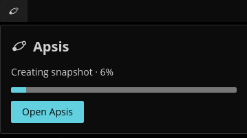

# Apsis

Apsis takes snapshots of your system and can put it back to one of them. It is made for the
COSMIC desktop: an applet in the panel shows when the last snapshot was taken and how full
the backup disk is, and a window creates, lists, deletes and restores snapshots.

Snapshots are taken with [rsync](https://rsync.samba.org) and hard-links, in Timeshift's
layout on the backup disk. Common files are shared between snapshots, so each one looks
complete but costs only the changes, and each is a plain folder you can browse with a file
manager. Snapshots made by Timeshift keep working in Apsis, and Timeshift is not needed.

Apsis protects system files and settings. Your home folder is left out unless you include
it, so restoring the system does not touch your documents.


## Features

### It lives in the panel

* The applet's tooltip shows the last snapshot and the backup disk; an optional label
  beside the icon shows both at a glance.
* The icon turns the warning colour when the last snapshot is older than you chose, or the
  disk is nearly full.
* Click it to see how full the backup disk is and how old the last snapshot is.
  **Open Apsis** opens the window.

 

### Snapshots when you want them

* **Create** takes a snapshot, with a comment if you like. The first one copies the whole
  system; later ones copy only what changed. rsync runs at idle priority, so the desktop
  stays responsive.
* **Delete** removes one or several snapshots. Nothing is created or deleted on a schedule.
* **Stop** ends a snapshot while it is being made; what it copied so far is removed.
* Creating, deleting and saving settings touch system files, so your system asks for your
  password (polkit). The window itself never runs as root.
* Shortcuts: `Ctrl+N` create, `Delete` delete, `Ctrl+R` or `F5` refresh, `Ctrl+,` settings,
  `Ctrl+A` select all, `Esc` close.

### Where snapshots go

* **Settings → Location** lists the disks that can hold snapshots; the others are listed
  with the reason. An external disk is best: a snapshot on the system disk won't help if
  that disk dies.
* If Timeshift was set up before, Apsis offers its disk and filters; **Save** keeps them.


### What is included

* The system is always included. `/root` and `/home` are tick boxes.
* **Filters** leave out (`-`) or keep (`+`) folders, files or patterns, as in Timeshift.
* With `/home` included, a restore can put your documents back as they were in the
  snapshot, or keep them as they are now.


The settings in detail: [docs/SETTINGS.md](docs/SETTINGS.md).

### Restore the system

* Select a snapshot and click **Restore**. Apsis checks that the snapshot fits this
  computer, takes a safety snapshot of the system as it is now, and asks you to restart.
* The restore runs at the next start with the desktop stopped, so no file is in use while
  it is replaced. Then the computer starts normally and the status line says how it went.
* The safety snapshot is the way back: restore it like any other snapshot.
* Restore is **experimental**. Read [Known limitations of restore](#known-limitations-of-restore)
  before you rely on it. The full guide: [docs/RESTORE.md](docs/RESTORE.md).

## Supported systems

- **Desktop:** COSMIC, on Pop!_OS 24.04 or any distribution shipping it. `rsync` and a
  polkit agent (COSMIC has one).
- **System disk:** plain, or encrypted the way Pop!_OS's installer does it with "Encrypt
  drive" (an LVM volume inside one LUKS partition). Restore supports both.
- **Backup disk:** a plain, unencrypted Linux filesystem (ext4, btrfs, xfs...). The backup
  disk cannot be LUKS-encrypted; the system disk can.
- **Restore:** UEFI with systemd-boot (kernelstub), as on Pop!_OS 24.04. GRUB, BIOS boot,
  btrfs and a system split over `/boot`, `/usr` or `/var` partitions are refused before
  anything happens.

## Install

**From the .deb** (Pop!_OS / Ubuntu 24.04 or newer, amd64): download
`apsis_<version>_amd64.deb` from the [releases page](https://github.com/atraxsrc/apsis/releases)
and install it from the folder you downloaded it to:

```sh
sudo apt install ./apsis_*.deb
```

**From source** (needs the build requirements under Contribute):

```sh
git clone https://github.com/atraxsrc/apsis
cd apsis
just                 # build (release)
sudo just install    # the applet, its launcher entry, and apsis-helper
```

Then add the applet: *COSMIC Settings → Desktop → Panel → Configure panel applets*, add
**Apsis**. Or open **Apsis** from the app launcher.

**Upgrading** is the same `apt install` with the new file. While a snapshot, a delete or a
restore's preparation runs, apt waits its turn and says so; run it again when the job has
finished. Coming from 0.3 or 0.4: [docs/TROUBLESHOOTING.md](docs/TROUBLESHOOTING.md).

## Uninstall

```sh
sudo apt remove apsis      # installed from the .deb (apt purge also removes /etc/apsis and /var/lib/apsis)
sudo just uninstall        # installed from source, run in the source folder
```

Your snapshots stay on the backup disk.

## Known limitations of restore

- Experimental, for Pop!_OS 24.04 with systemd-boot only.
  Restore is new: a report of how it went on your hardware, good or bad, helps.
- An encrypted system disk works in Pop!_OS's "Encrypt drive" layout only. Its passphrase
  is asked twice: at the restart that runs the restore, and at the start after it.
- The live `/etc/fstab` and `/etc/crypttab` are kept, not the snapshot's. The boot files
  are refreshed with kernelstub; if that fails or the result fails the check, the computer
  keeps the boot files and the kernel it started with.
- A snapshot made while Apsis 0.5.x was installed puts 0.5.x back.
- Hard links are not kept in snapshots (as in Timeshift), and a file changed in place with
  the same size and time as in the snapshot is not restored.

The full list, and how Apsis's restore differs from Timeshift's: [docs/RESTORE.md](docs/RESTORE.md).

## If a restore goes wrong

Don't keep restarting. Boot **Pop!_OS Recovery** (hold Space at power-on) or a live USB
and follow [docs/RECOVERY.md](docs/RECOVERY.md). Every time Apsis prepares a restore it
writes the exact commands for this computer to `timeshift/apsis-restore-RECOVER.txt` on the
backup disk. Keep that page where you can read it without this computer.

## Troubleshooting

| you see | what to do |
|---|---|
| Backup disk not connected | plug it in; Apsis notices and lists again |
| the list fails with a `mount` error that says the disk is already mounted | the desktop opened the backup disk by itself: unmount it in Files (unmount, don't eject), then Refresh |
| the applet doesn't show after installing | log out and back in, or re-add it in *Configure panel applets* |
| anything else | `journalctl -u apsis-helper -e`, and [docs/TROUBLESHOOTING.md](docs/TROUBLESHOOTING.md) |

Bugs and questions: [open an issue](https://github.com/atraxsrc/apsis/issues). Say which
version (the window's About page shows it), what you did and what the status line or the
dialog said. Logs hold disk UUIDs, your user name and your computer's name: take out what
you don't want public. A security problem doesn't go in an issue: report it privately as
[SECURITY.md](SECURITY.md) describes.

## Contribute

- Build requirements: Rust (stable), [`just`](https://github.com/casey/just) and
  libcosmic's build dependencies. On Pop!_OS / Ubuntu / Debian:

```sh
  sudo apt install cargo just pkgconf libexpat1-dev libfontconfig-dev libfreetype-dev \
    libxkbcommon-dev libwayland-dev
```

- `just run` runs Apsis in a window, no root needed. Before a pull request, run what CI
  runs: `cargo fmt --all --check`, `cargo clippy --locked --workspace --all-targets -- -D warnings`
  and `cargo test --locked --workspace`.
- A report of how Restore went on your hardware, good or bad, is especially useful.
- The window's texts are in `i18n/en/apsis.ftl`. English is the only language so far.
- Bug reports, ideas, pull requests and security reports: [CONTRIBUTING.md](CONTRIBUTING.md).

## Name

In orbital mechanics an apsis is a turning point on an orbit, the point a body comes back
to. The logo is an orbit with its two apsides, the glowing one being the point you return to.

## License

GPL-3.0-only. See [LICENSE](LICENSE).
